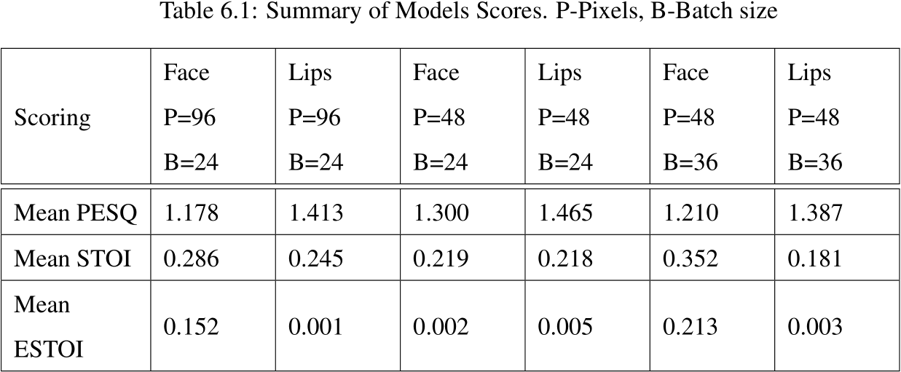

# LipReader-Transformer
A transformer model to generate audio based on the readers lips and face

A collaboration with my classmate for our final year project.

This is a transformer implementation of [Lip2Wav](https://github.com/Rudrabha/Lip2Wav) and is modified to work with lips.

The dataset used was a single speaker from Lip2Wav. We have made our own preprocessor to extract just the lips of the reader from the video.

#### Working
Many lip-reading codes assume that using the full face of a speaker may lead to better output. We, however, believe this isn't the case and that using the lips or mouths alone may be sufficient enough to get a good prediction. To test this we modified the working of a lip reading algorithm into a newer architecture then ran similar tests using a variety of datasets.

#### Results
Loss Graph

Scores

full-face tends to be better than lips on all objective tests but lips beat face on the subjective test. this is assume to be due to the reduced number of features in lips affecting the ability to learn for short periods of time and thus not providing accurate results; however, since lip shapes are less unique and the same shapes are used in different sounds, the model was able to improve voice quality instead of accuracy which led to a higher PESQ score. However this also shows how full face is better than lip in terms of learning as it is able to quickly predict audio from the frames provided.
